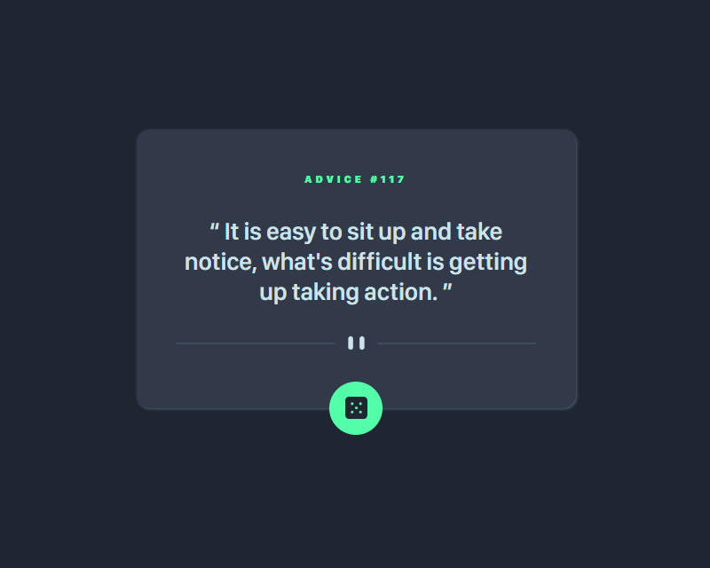

# Frontend Mentor - Challenge: Advice Generator App

## About the Challenge 🚀

In this Frontend Mentor challenge it was proposed to create an application that consumes an advice API, using HTML, CSS and JS and an API. The board id is changed along with its content when the user clicks the data button. The goal was to follow the design provided in Figma and ensure that the app was responsive on mobile devices. 📱

## App 📱 Layout


## Challenge Link in Frontend Mentor 🎨

[Click here to view the challenge in Frontend Mentor](https://www.frontendmentor.io/solutions/advice-generator-app-with-html-css-js-and-api-781t3OuqcH) 👀

## Responsive Layout 📱

To make the App responsive on mobile devices, a media query has been added with a new lower resolution image that is shown only when the screen is less than 425px wide:

```css
@media (max-width: 425px) {
    .card .img .img-desktop {
        Display: None;
    }

.card .img .img-mobile {
        Display: Block;
    }
}
```
In addition to the font it gets smaller. 📏

```css
    font-size: clamp(2rem, 2.8rem, 3.3rem);
```

## Technologies Used 💻

- HTML
- CSS
- JavaScript
- API - random board


## API ✨ consumption
[Click here to view the API website](https://api.adviceslip.com/) 👀

In JavaScript a function with async/await and fecth metod was added to work with this API

```JS
async function advice() {
    const response = await fetch('https://api.adviceslip.com/advice')
    return await response.json()
}
```
## Application ✨ Features

The Advice Generator App developed has the following features:

1. Generate a new Council.
2. Generate an id for the board.
3. Apply a spin effect to the button.


## Instructions for Execution 🛠️

1. Clone the project repository on your local machine.
2. Open the "index.html" file in your preferred browser.
3. Click the button and watch the advice change, wait 2 seconds or until the btao animation finishes to click again.

## Project page

- [Access project page](https://etvaldolisboa.github.io/advice-generator-app/)
